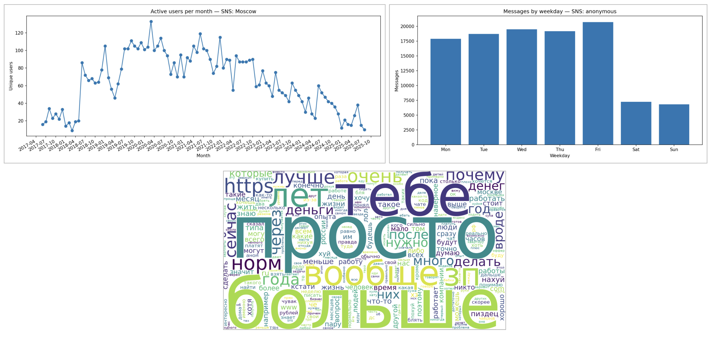
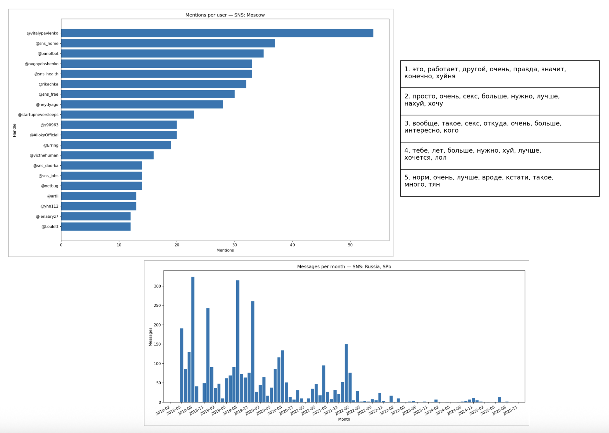
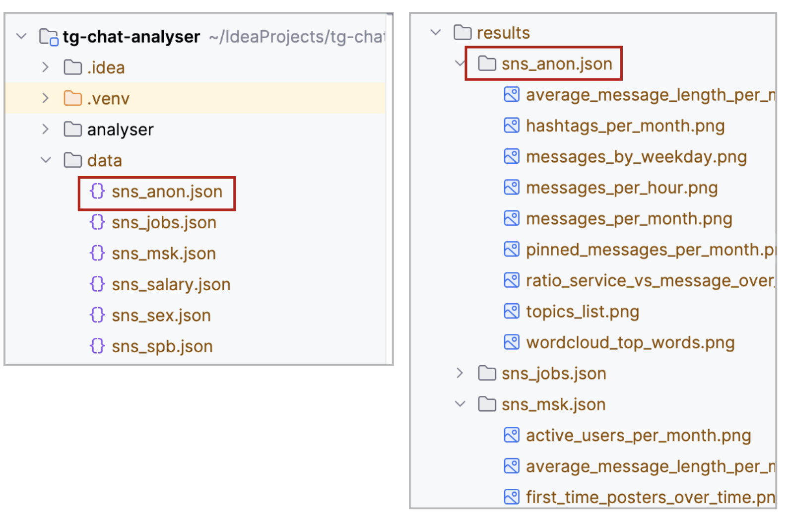

# 📊 Telegram Chat Analyzer

Analyze Telegram chat exports and generate interactive statistics and visualizations — all locally, right in your
browser.




---

## 📚 Table of Contents

- [Features](#-features)
- [Installation](#-installation)
- [Exporting Data from Telegram](#-exporting-data-from-telegram)
- [Configuration](#-configuration)
- [Usage](#-usage)
- [Example Visualizations](#-example-visualizations)
- [Project Structure](#-project-structure)
- [Contributing](#-contributing)
- [License](#-license)
- [Author](#-author)

---

## ✨ Features

- 📈 **Charts & Graphs** — message activity, top users, word clouds, emoji usage, and more.
- 🗂 **Multiple Chat Formats** — supports Telegram JSON export.
- ⚡ **Local Processing** — no server required, data stays on your machine.
- 🔌 **Extensible** — easily add new metrics by creating custom processors.

---

## 📦 Installation

```
git clone https://github.com/username/telegram-chat-analyzer.git

сd telegram-chat-analyzer
```

---

## 📥 Exporting Data from Telegram

[См. подробности в инструкции](docs/how_to_extract_data/how_to_extract_data.md)

---

## 🚀 Configuration

[Конфигурация](config.yaml)


---

## 🚀 Usage

Run the analyzer:

```
make run
```

Output will be saved in the `result/` folder.  
Open `index.html` in your browser to view the interactive dashboard.



---

## 📊 Example Visualizations

В проекте уже присутствуют следующие типы графиков:

| Chart | Link                                                             |
|-------|------------------------------------------------------------------|
| Active Users per Month | [More](docs/graphics_info/active_users_per_month.md)             |
| First Time Posters Over Time | [More](docs/graphics_info/first_time_posters_over_time.md)       |
| Join/Leave Events per Month | [More](docs/graphics_info/join_leave_events_per_month.md)        |
| Mentions per User | [More](docs/graphics_info/mentions_per_user.md)                  |
| Top Users by Message Count | [More](docs/graphics_info/top_users_by_messages_from_id.md)      |
| Average Message Length per Month | [More](docs/graphics_info/average_message_length_per_month.md)   |
| Hashtags per Month | [More](docs/graphics_info/hashtags_per_month.md)                 |
| Messages by Weekday | [More](docs/graphics_info/messages_by_weekday.md)                |
| Messages per Hour | [More](docs/graphics_info/messages_per_hour.md)                  |
| Messages per Month | [More](docs/graphics_info/messages_per_month.md)                 |
| Pinned Messages per Month | [More](docs/graphics_info/pinned_messages_per_month.md)          |
| Ratio: Service vs. Messages Over Time | [More](docs/graphics_info/ratio_service_vs_message_over_time.md) |
| Topics NMF | [More](docs/graphics_info/topics_nmf.md)                         |
| Wordcloud Top Words | [More](docs/graphics_info/wordcloud_top_words.md)                |

---

## Custom visualization

TODO


---

## 📂 Project Structure

```
telegram-chat-analyzer/
│
├── processors/         # Data processing scripts
├── templates/          # HTML templates for visualization
├── docs/               # Screenshots and documentation
├── output/             # .json Telegram chat data exported files
├── data/               # Generated charts and dashboards
├── main.py             # Entry point
├── requirements.txt    # Python dependencies
├── config.yaml         # Configurations and settings
├── LICENSE             # License file
└── README.md           # This file
```

---

## 🤝 Contributing

Contributions are welcome!  
If you want to add new processors or improve documentation:

1. Fork the repository
2. Create a new branch (`feature/my-feature`)
3. Commit changes
4. Submit a Pull Request

---

## 📜 License

This project is licensed under the [MIT License](LICENSE).

---

## 👤 Author

**Your Name**

- GitHub: [@artur-gavronchuk](https://github.com/artur-gavronchuk)
- Telegram: [@it_is_artur](https://t.me/it_is_artur)
- Website: [artur-in.me](https://artur-in.me/)
