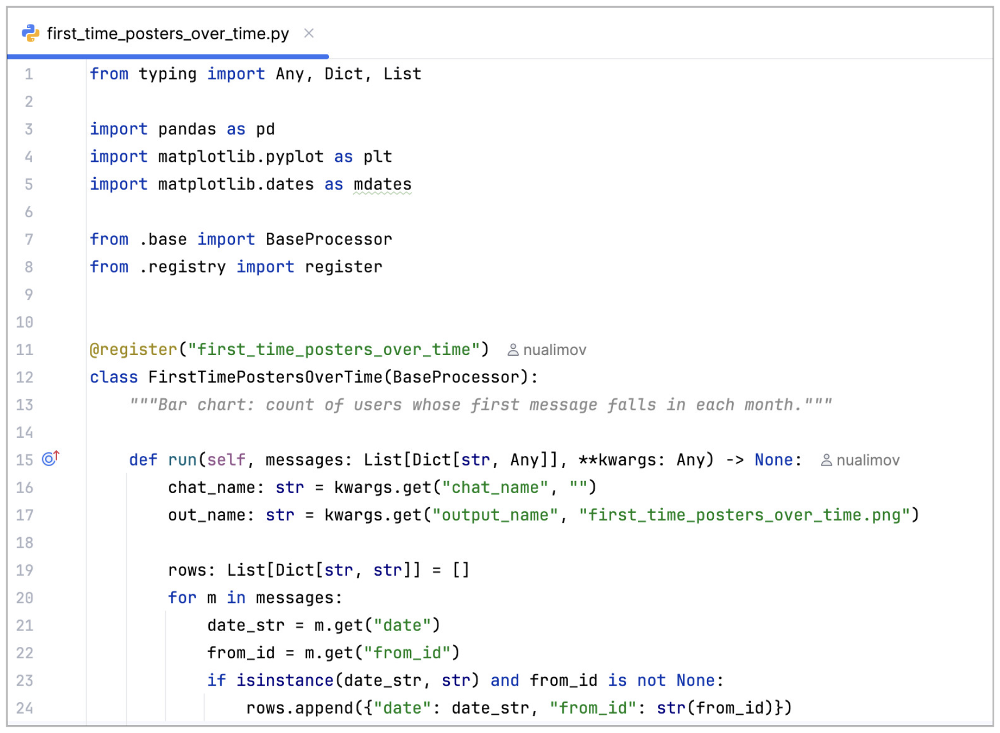
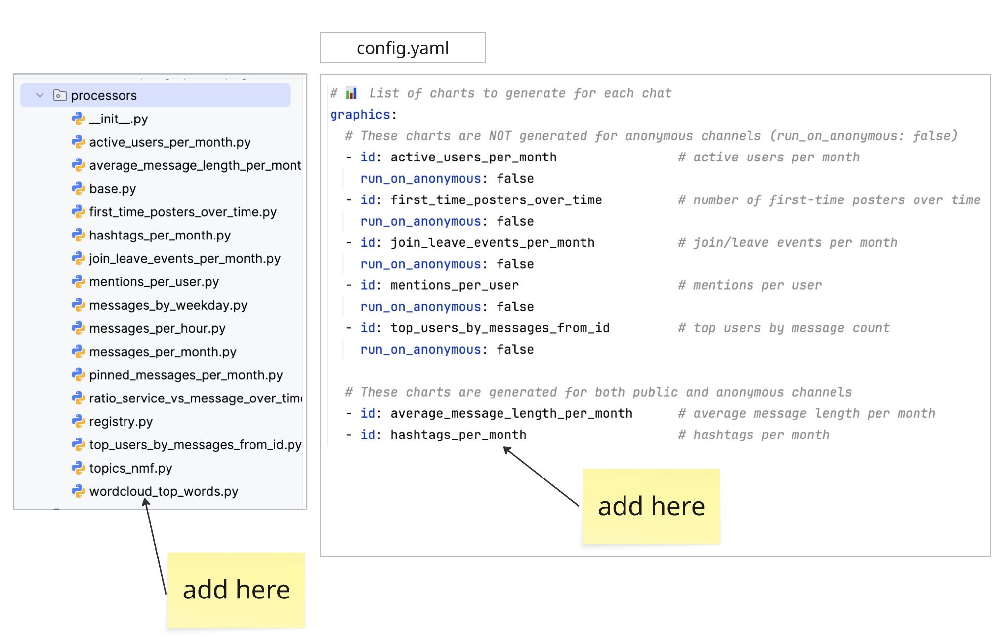
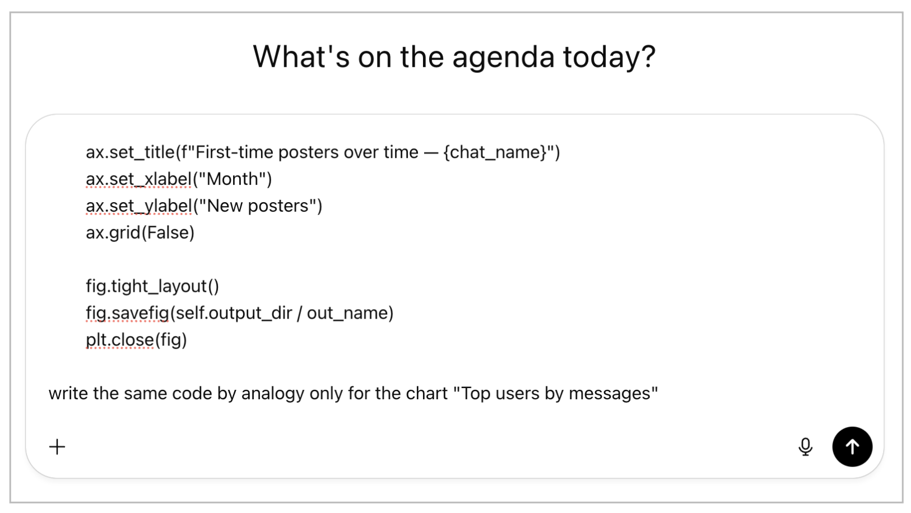

## How to Add Your Own Visualization

In addition to the already included charts, you can add your own.

1. Create code in a `.py` file (either manually or with ChatGPT).

2. Add this file to the `processors` folder of the project and specify
   the required configuration in `config.yaml`.

#### How to Write with ChatGPT

Insert the code of an existing chart from the project, asking to make a
similar one but with the visualization you need.

For example: `Top users by messages`

