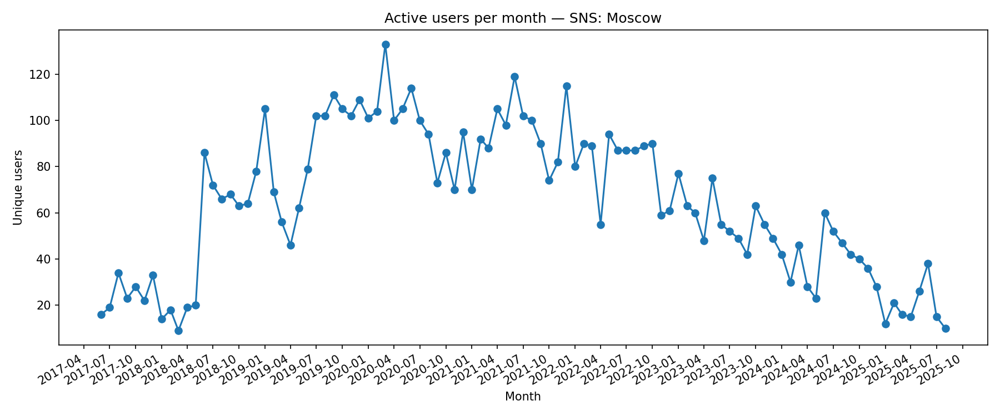

## Active Users per Month

**Definition:**  
Shows the number of **unique users** who sent at least one message each month.

**How it works:**

- Extract `from_id` from all messages.
- Group by month and count unique `from_id` values.
- Plot the result as a monthly time series.

**Why it’s useful:**

- Measures the **overall engagement** of the community.
- Helps identify months with unusually high or low activity.

---

