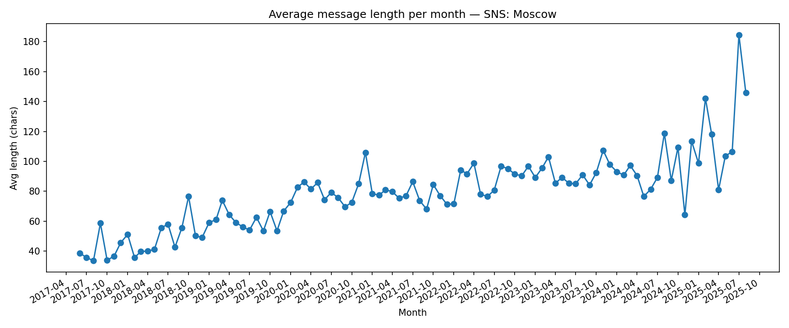

## Average Message Length per Month

**Definition:**  
Shows the **average number of characters or words** per message for each month.

**How it works:**

- For each message, calculate its length (characters or words).
- Group by month and compute the average.
- Plot as a trend line.

**Why it’s useful:**

- Indicates whether the chat is becoming **more concise or more verbose** over time.
- Can reflect changes in chat style or topics.

---

