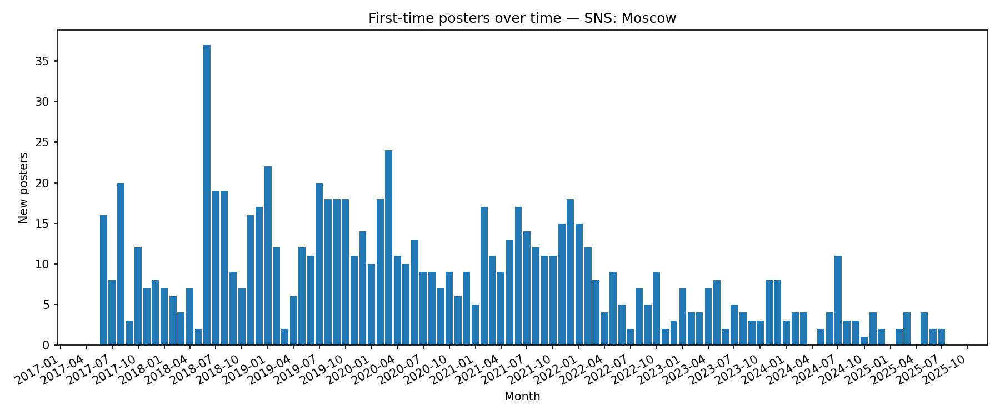

## First-Time Posters Over Time

**Definition:**  
Shows when **new participants** posted their first message in the chat.

**How it works:**

- For each `from_id`, find the date of their **first message**.
- Group these first-message dates by month (or week).
- Count how many new authors appeared in each period.

**Why it’s useful:**

- Tracks the **inflow of new members**.
- Highlights spikes in newcomers, possibly linked to events or promotions.

---

