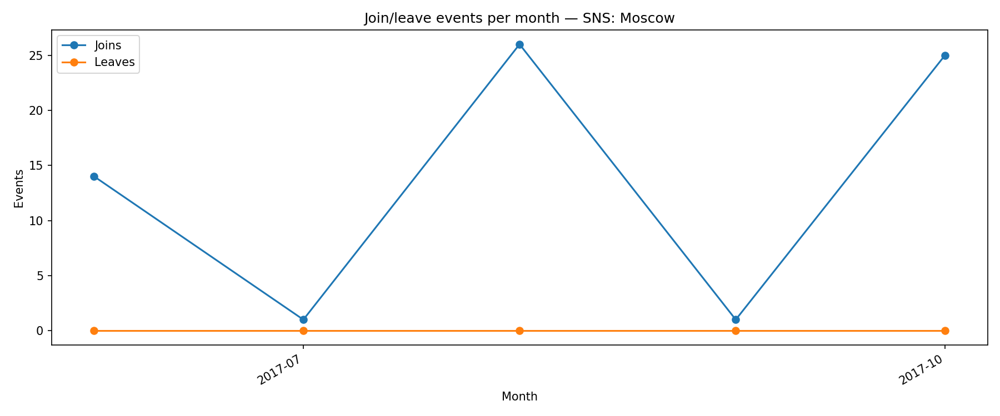

## Join/Leave Events per Month

**Definition:**  
Shows the number of **user joins** and **leaves** per month.

**How it works:**

- For joins: `action == 'invite'` or `action == 'join'`.
- For leaves: `action == 'leave'` or similar.
- Count events per month for each type.

**Why it’s useful:**

- Tracks **community turnover**.
- Helps understand periods of growth or loss.

---

