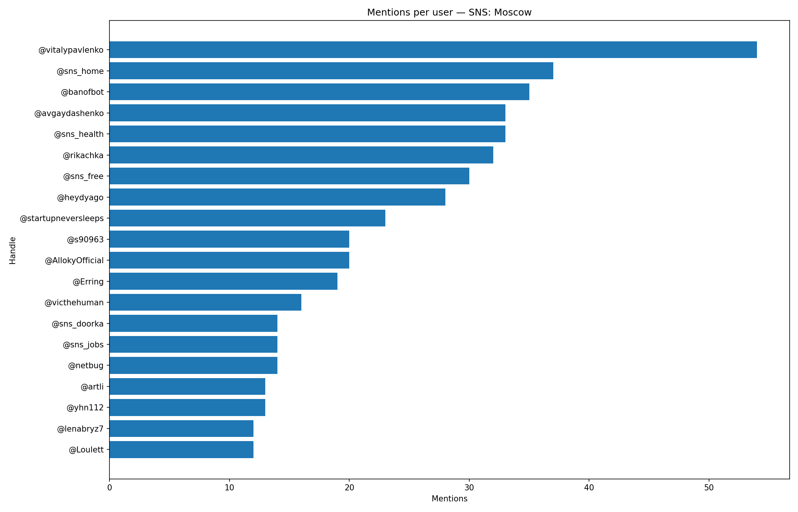

## Mentions per User

**Definition:**  
A leaderboard showing how many times each user was **mentioned** with `@username`.

**How it works:**

- Parse `text_entities` with type `mention`.
- Count the number of mentions per mentioned username.

**Why it’s useful:**

- Identifies **central figures** in discussions.
- Can indicate influencers or popular members in the chat.

---

