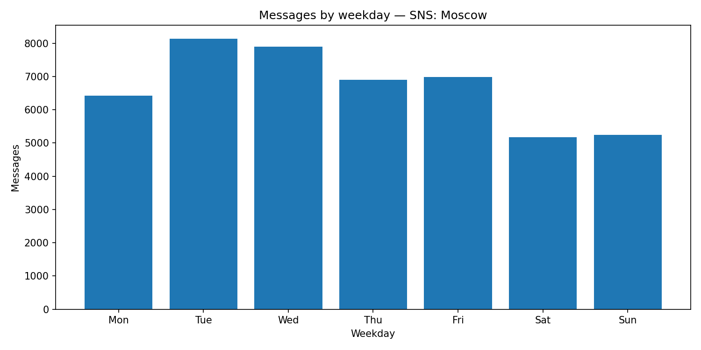

## Messages by Weekday

**Definition:**  
Shows how many messages are sent on each day of the week (Mon–Sun).

**How it works:**

- Extract weekday from message `date`.
- Count messages per weekday.

**Why it’s useful:**

- Reveals **weekly activity patterns**.
- Helps plan events or announcements for peak days.

---

