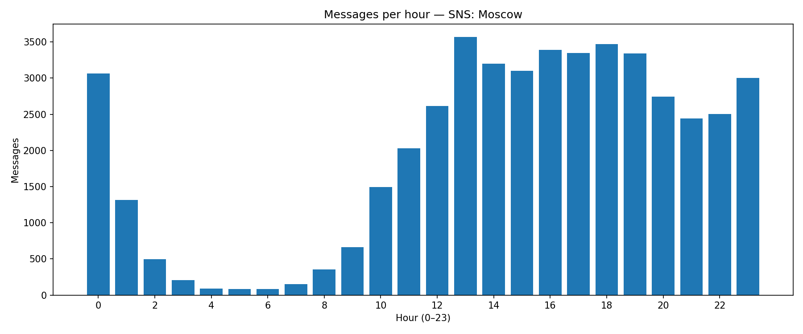

## Messages per Hour

**Definition:**  
Shows the number of messages sent at each hour of the day (0–23).

**How it works:**

- Extract hour from message `date`.
- Count messages per hour.

**Why it’s useful:**

- Reveals **daily activity cycles**.
- Helps choose the best posting time.

---

