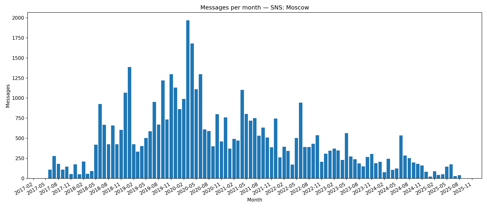

## Messages per Month

**Definition:**  
Shows the total number of messages sent each month.

**How it works:**

- Group messages by month using `date`.
- Count messages in each month.

**Why it’s useful:**

- A **basic engagement metric** over time.
- Highlights long-term trends and seasonal changes.

---

