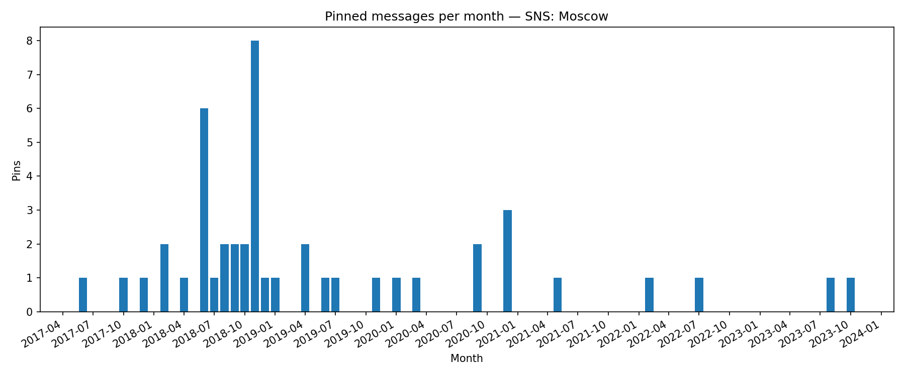

## Pinned Messages per Month

**Definition:**  
Shows the number of pinned messages in the chat each month.

**How it works:**

- Filter messages where `action == 'pin_message'`.
- Group by month and count.

**Why it’s useful:**

- Pinned messages often mark **important events** or announcements.
- Peaks can indicate busy or significant periods.

---

