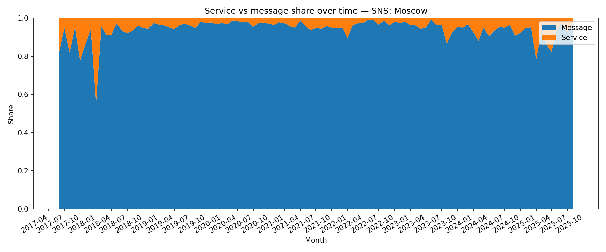

## Ratio Service vs Message Over Time

**Definition:**  
Shows the proportion of **service messages** (joins, leaves, pins) vs normal text/media messages over time.

**How it works:**

- Classify each record as `service` (type=`service`) or `message`.
- Count totals per month and compute percentages.

**Why it’s useful:**

- Gives context for activity: high service ratio may mean many joins/leaves but little conversation.
- Useful for monitoring **community health**.

---

