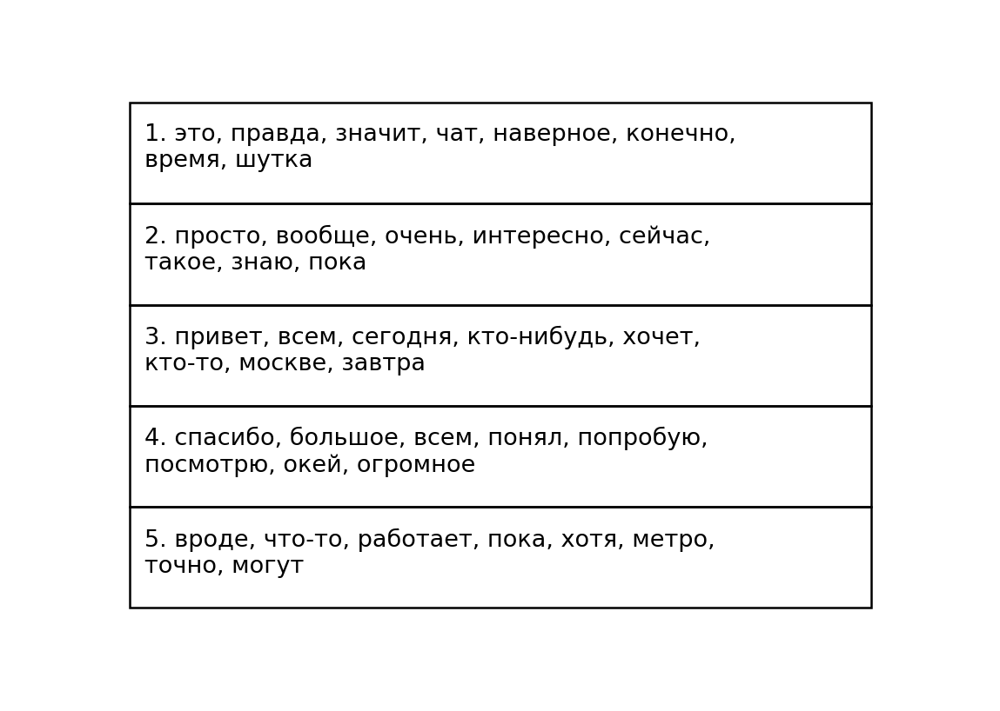

## Topics (NMF)

**Definition:**  
Identifies the most common **word clusters** (topics) in chat messages using **Non-negative Matrix Factorization (NMF)
**.

**How it works:**

- Preprocesses all message texts (lowercasing, removing punctuation, stopwords, and short words).
- Converts text into a **TF–IDF matrix**.
- Applies the NMF algorithm to extract a fixed number of topics.
- For each topic, selects the top words with the highest weight.
- Displays topics in a simple text table for quick review.

**Why it’s useful:**

- Reveals the **main discussion themes** in the chat.
- Allows you to see **how conversations evolve** over time.
- Helps detect emerging interests or recurring issues in the community.

---

