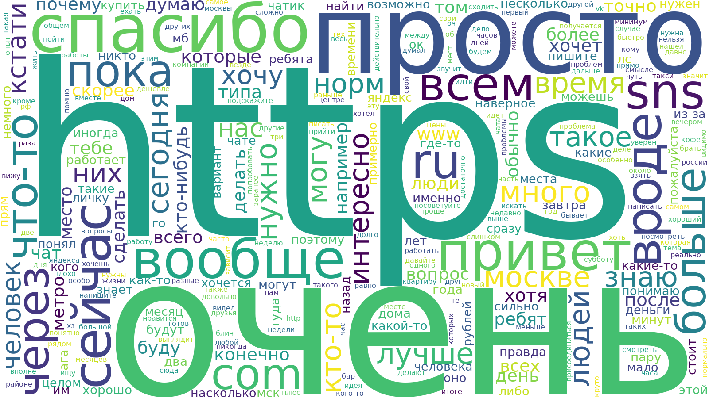

## Wordcloud – Top Words

**Definition:**  
Generates a **word cloud** showing the most frequently used words in all chat messages.

**How it works:**

- Extracts text from all messages.
- Cleans it (lowercasing, removing punctuation, stopwords, numbers, and short words).
- Counts word frequencies across the entire dataset.
- Visualizes the most frequent words in a **word cloud**, where font size represents frequency.

**Why it’s useful:**

- Quickly highlights the **most common vocabulary** in the chat.
- Helps spot key discussion points at a glance.
- Provides an engaging and easy-to-read visual summary of chat content.

---

