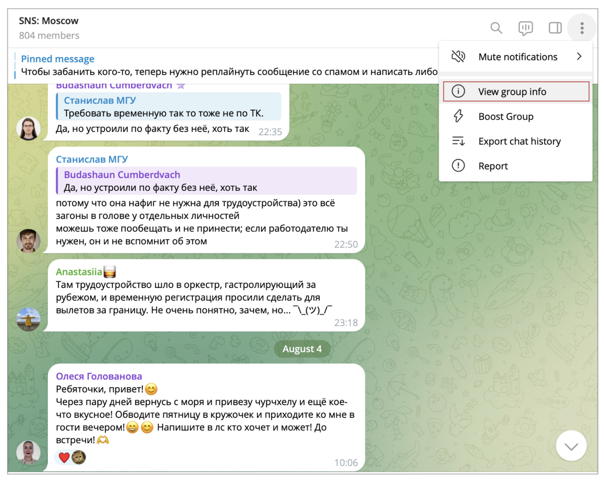
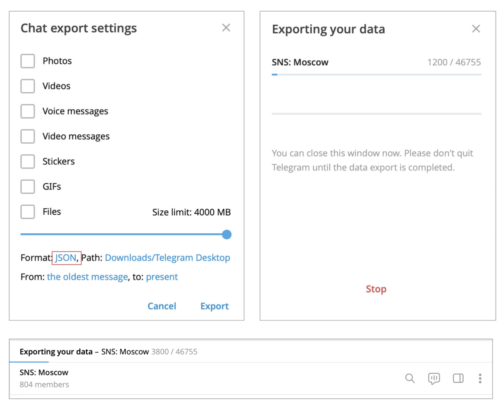
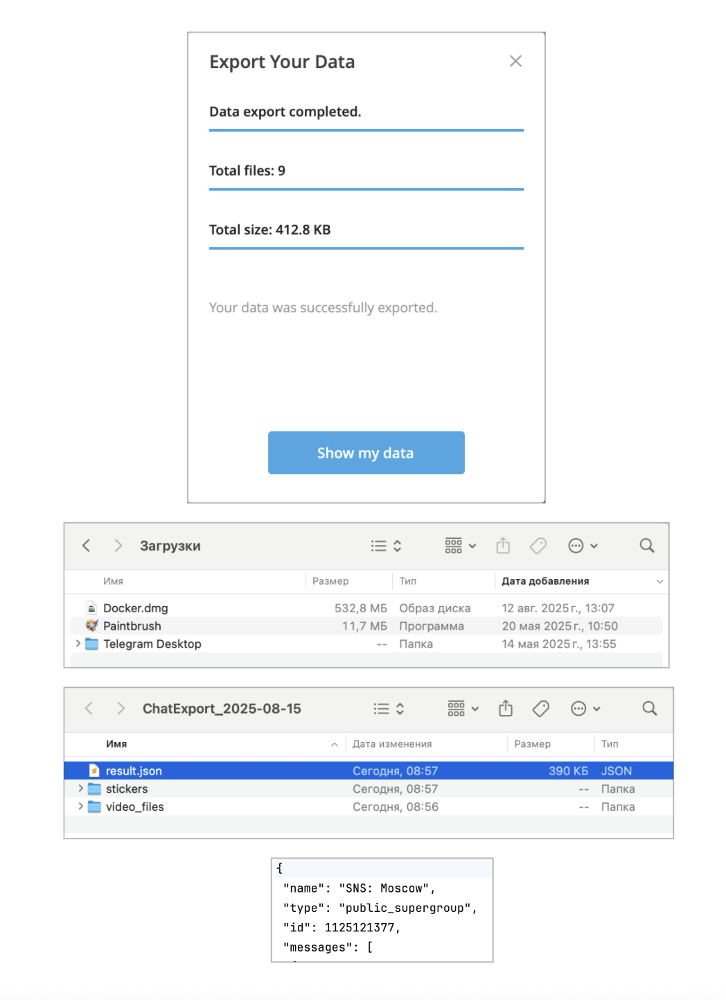

## How to Get Data for Analysis

Below is a step-by-step guide on how to export data from Telegram for analysis.

The screenshots and instructions are relevant for:

- macOS
- Telegram Desktop

---

### 1. Start the Data Download

- Open the channel you are interested in.
- Click on the **three dots** menu.
- Select **View group info**.

In the drop-down menu, set the following options:

* Uncheck all boxes (we don’t need the media files themselves, only information about them in text format).
* Set the format to **JSON**.
* Optionally, move the slider to the maximum value.

Wait for the download to complete.

---

### 2. Check the Downloaded Data

The folder will be created in the same directory where Telegram saves all your files.  
In most cases, this will be the **Downloads** folder.

